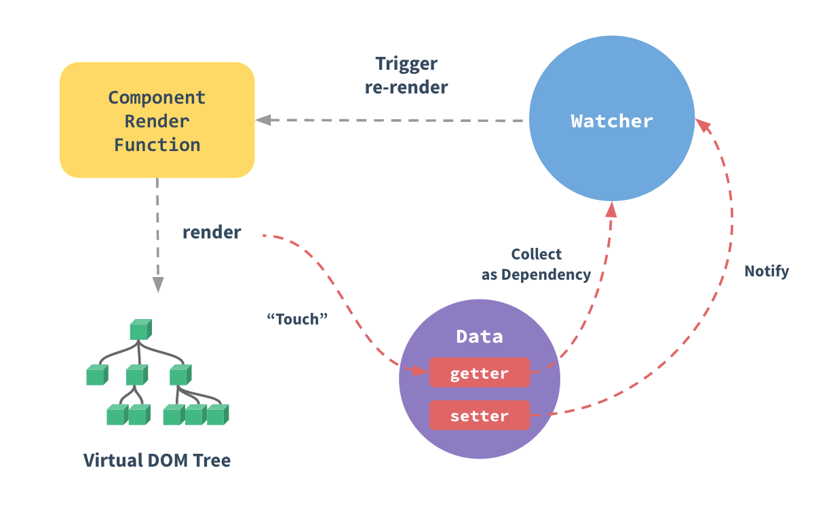

---

id:js1

title:响应式原理

---

## vue2中响应式

当你把一个普通的 JavaScript 对象传入 Vue 实例作为 data 选项，Vue 将遍历此对象所有的 property，并使用 `Object.defineProperty` 把这些 property
全部转为 `getter/setter`。



### 缺点

因为 defineProperty 需要明确知道对象上key的名称,`Object.defineProperty(obj, key,{})`,无法得知是否新增属性,所以在vue内部使用了`vue.$set`来给对象新增。 
无法监听数组的变化,所以vue内部重写了`[
'push',
'pop',
'shift',
'unshift',
'splice',
'sort',
'reverse'
]`

```js
const obj = {
    name: '小明',
    age: 18
}

function Intercept(obj, key) {
    const key_ = obj[key]
    Object.defineProperty(obj, key, {
        get() {
            return key_  //因为不能返回原对象的getter 
        },
        set(value) {
            //observer观察者,可以拿到改变的值然后去做相应的操作
            observer(value)
        }
    })
}

Intercept(obj, 'name')

```

## vue3中响应式

```js

new Proxy()

```
